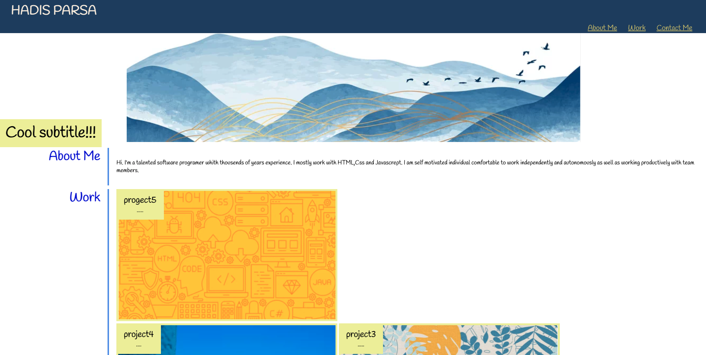
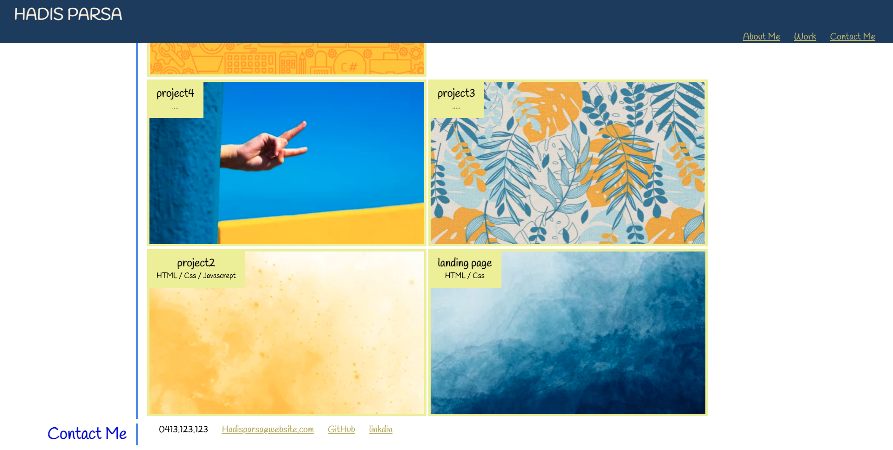
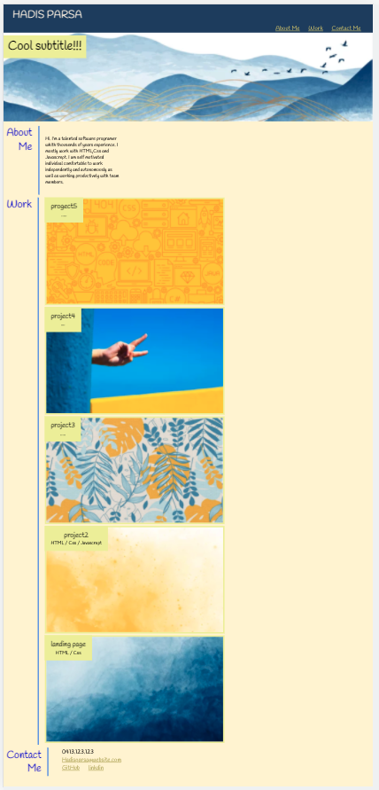

# Portfolio-page

## Introduction  
I was tasked to crate a page that users could review samples of my works.
Creating this page improve my HTML and advanced CSS coding knowledge.
```
The result of loading this portfolio : 
There are samples of previous works.

The page navigation bar presents with the developer's name and links to sections about them, their work, and how to contact them.

The UI scrolls to the corresponding section if you click one of the links in the navigation.

The UI scrolls to a section with titled images of the developer's applications by clicking on the link to the section about their work.

By presenting with the developer's one of the applications, that application's image will be smaler in size than the others.

Click on the images of the applications will take to that deployed application.

The page or view the site on various screens and devices is presented with a responsive layout that adapts to viewport.

```
This task helped me to expand my HTML and advance CSS.


## Installation
this portfolio page is created from scrtch , and more project will be add to as followig learning progresses. 
The web page is created by HTML and stlyled by advance Css.

## Link
You can experience the deployed project here: [Portfolio Page URL ](https://hadisparsa.github.io/portrtfolio-page/).

## Page presented view in small and big screen:




## Key Topics (Resources)

The following toping are useful resurses to create a sample page:

* [Media queries](https://developer.mozilla.org/en-US/docs/Web/CSS/Media_Queries/Using_media_queries)

* [Flexbox](https://developer.mozilla.org/en-US/docs/Web/CSS/CSS_Flexible_Box_Layout/Basic_Concepts_of_Flexbox)

* [Responsive design](https://developer.mozilla.org/en-US/docs/Learn/CSS/CSS_layout/Responsive_Design)

* [CSS resets](https://developer.mozilla.org/en-US/docs/Learn/CSS/Building_blocks/Cascade_and_inheritance)

* [Pseudo-classes](https://developer.mozilla.org/en-US/docs/Web/CSS/Pseudo-classes)

* [Pseudo-elements](https://developer.mozilla.org/en-US/docs/Web/CSS/Pseudo-elements)

* [Transitions](https://developer.mozilla.org/en-US/docs/Web/CSS/transition)

* [Typography](https://developer.mozilla.org/en-US/docs/Learn/CSS/Styling_text/Fundamentals)

* [CSS variables](https://developer.mozilla.org/en-US/docs/Web/CSS/Using_CSS_custom_properties)

* [Advanced box styling](https://developer.mozilla.org/en-US/docs/Learn/CSS/Howto/create_fancy_boxes)

* [Advanced CSS selectors](https://developer.mozilla.org/en-US/docs/Learn/CSS/Building_blocks/Selectors/Combinators)

* [Wireframes](https://en.wikipedia.org/wiki/Website_wireframe)

---

© 2021 
